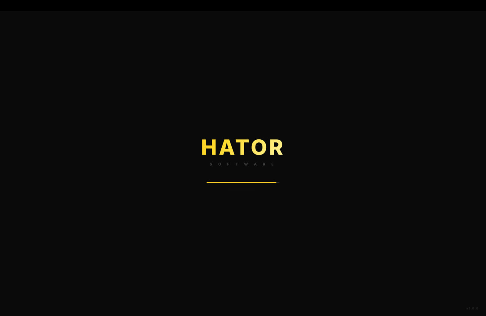
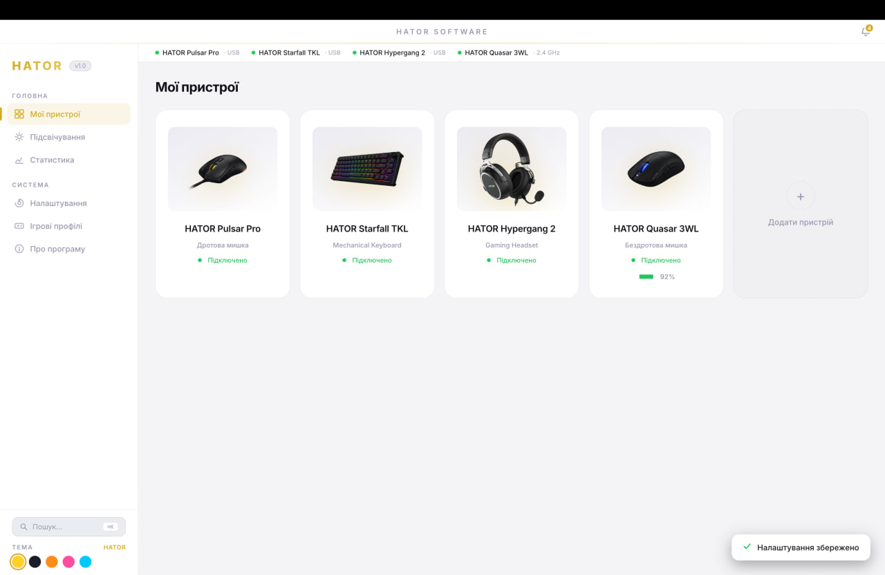
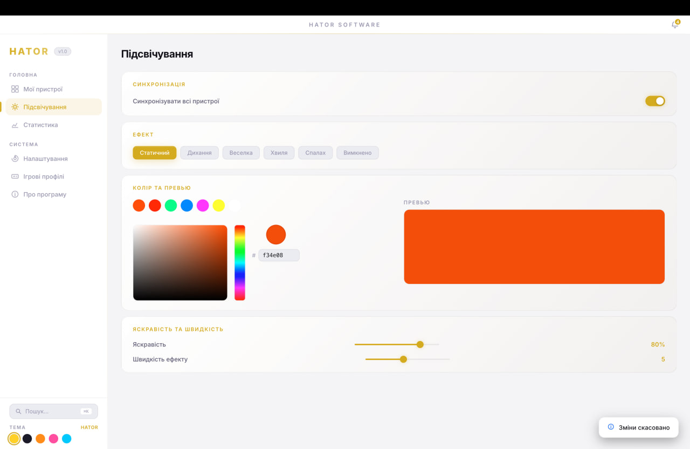
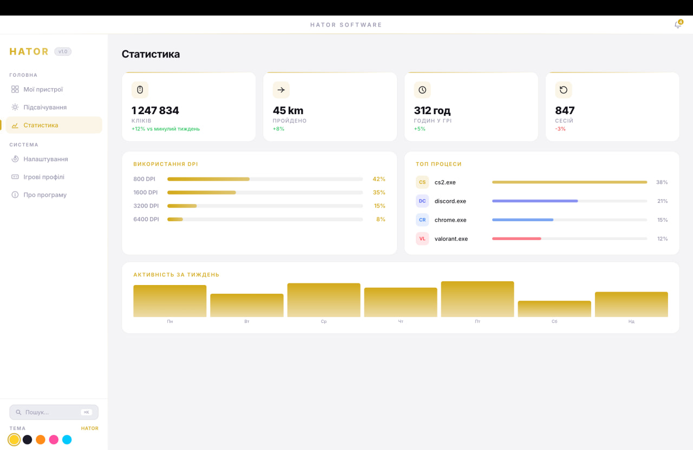
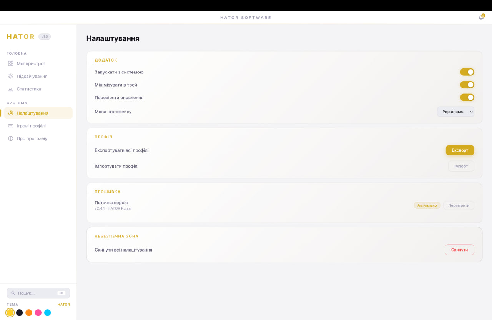
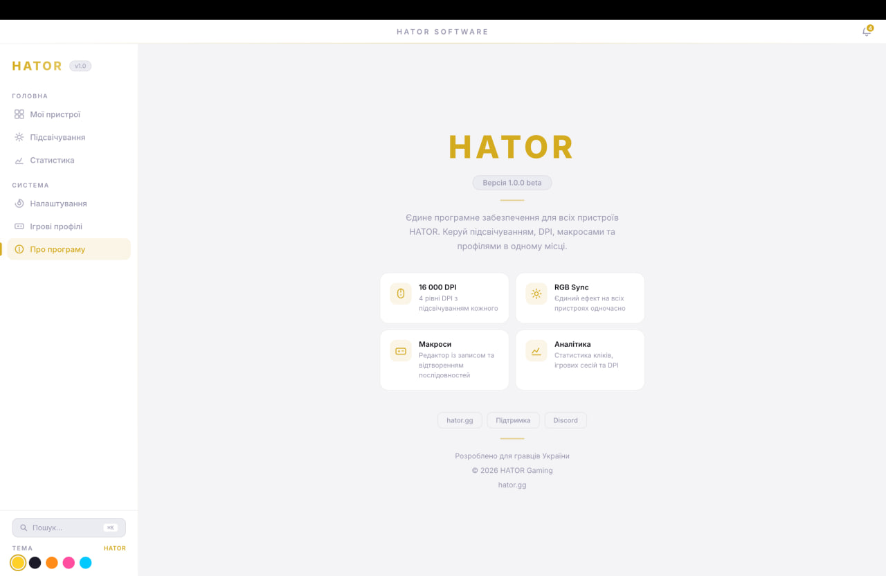

<div align="center">

# HATOR Software

**UI concept of the game peripheral control program**

[](https://www.electronjs.org/)
[]()
[]()
[]()

</div>

---

## About the project

Повноцінний UI-прототип програми для керування периферією HATOR — аналог Razer Synapse / Logitech G Hub, адаптований під екосистему пристроїв HATOR.

Реалізовано як Electron-додаток на чистому HTML/CSS/JS без фреймворків.

---

## Screenshots

| | |
|---|---|
|  |  |
| *Сплеш-екран* | *Мої пристрої* |
|  |  |
| *Підсвічування з color picker* | *Статистика* |
|  |  |
| *Налаштування* | *Про програму* |

---

## Opportunities

###  Mouse
- Налаштування DPI з кольоровими рівнями (200 – 16 000 DPI)
- Частота опитування, прискорення
- Призначення 6 кнопок
- RGB-підсвічування з color picker та живим превью

###  Keyboard
- Візуальний превью з RGB-анімацією в реальному часі
- 8 ефектів підсвічування включно з Ripple та Reaction
- Редактор макросів із записом послідовностей клавіш (F1–F12)

###  Headphones
- Регулювання гучності та просторового звуку
- 10-смуговий еквалайзер
- Керування мікрофоном (гучність, шумозаглушення, моніторинг)

###  Global illumination
- Синхронізація RGB на всіх пристроях одночасно
- Color picker з підтримкою HEX
- 6 ефектів з живим превью-баром

###  Game profiles
- Автоматичне перемикання профілю за назвою процесу гри
- Збереження в localStorage

###  Statistics
- Лічильники кліків, дистанції, часу в грі, сесій
- Графік активності за тиждень
- Топ процеси, розбивка використання DPI

###  System
- 4 теми оформлення (HATOR, Dark, Pink, Neon)
- Двомовний інтерфейс: українська та англійська
- Глобальний пошук (Ctrl+K) з індексом розділів
- Сповіщення, анімований сплеш-екран
- Клавіатурні шорткати (1–5, Ctrl+K, Esc)

---

## Запуск

```bash
# Встановити залежності
npm install

# Запустити
npm start
```

**Вимоги:** Node.js 18+, npm

---

## Структура проекту

```
hator-app/
├── index.html        # Весь інтерфейс (HTML + CSS + JS)
├── main.js           # Electron main process
├── images/           # Зображення пристроїв
├── icons/            # Іконки додатку
├── screenshots/      # Скріншоти
└── package.json
```

---

## Stack

| Технологія | Використання |
|---|---|
| [Electron](https://www.electronjs.org/) | Десктопна оболонка |
| HTML / CSS / JS | Весь інтерфейс, без фреймворків |
| [node-hid](https://github.com/node-hid/node-hid) | Підключення HID-пристроїв |
| localStorage | Збереження налаштувань |
| Canvas API | RGB-анімації та color picker |

---

<div align="center">

Розроблено для гравців України 🇺🇦

**· 2026**

</div>
